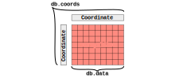

# Data Structures

## Database

## Coordinate

Because data is generally sampled with a constant sampling rate/resolution keeping the 
corresponding value for each index as a dense array is inefficient. In `xdas`
coordinates are saved using the 
[CF convention][CF]. Only a few tie points are kept and intermediate values are retrieved
by linear interpolation. Discontinuities are marked by two consecutive tie points.

## DataCollection

[CF]: <http://cfconventions.org/Data/cf-conventions/cf-conventions-1.10/cf-conventions.html#compression-by-coordinate-subsampling>